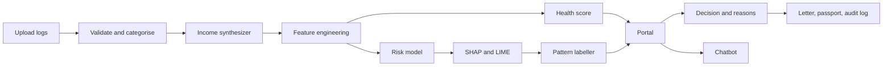
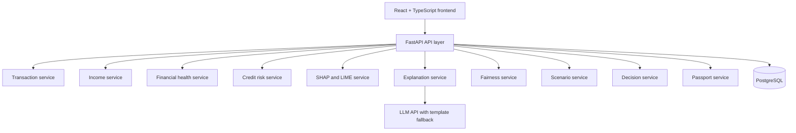
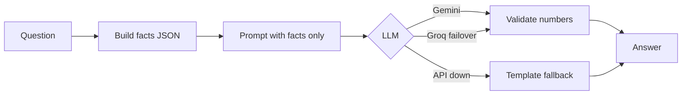

# Explainable Alternative Credit Scoring & Informal Income Synthesizer

> A loan-officer portal that scores borrowers with **no payslip and no credit-bureau history**, using everyday financial behaviour, and explains **every decision** in plain language.


---

## Table of Contents

1. [Overview](#1-overview)
2. [Problem Statement](#2-problem-statement)
3. [Objectives](#3-objectives)
4. [Users](#4-users)
5. [Features](#5-features)
6. [Workflow](#6-workflow)
7. [Portal Screens](#7-portal-screens)
8. [Architecture](#8-architecture)
9. [Tech Stack](#9-tech-stack)
10. [API Design](#10-api-design)
11. [Data Model](#11-data-model)
12. [Machine-Learning Strategy](#12-machine-learning-strategy)
13. [Grounded AI Chatbot](#13-grounded-ai-chatbot)
14. [Security, Privacy and Responsible Use](#14-security-privacy-and-responsible-use)
15. [Project Structure](#15-project-structure)
16. [Roadmap](#16-roadmap)
17. [Testing and Acceptance Criteria](#17-testing-and-acceptance-criteria)
18. [Local Setup](#18-local-setup)
19. [Demo Scenario](#19-demo-scenario)
20. [Limitations and Future Work](#20-limitations-and-future-work)
21. [Glossary](#21-glossary)
22. [Team and License](#22-team-and-license)

---

## 1. Overview

Street vendors, gig workers, freelancers and small shop owners often have no payslips and no credit history, so banks reject them. Modern alternative-data models can score them, but most are black boxes that cannot give the reasons a lender is expected to provide when denying credit.

This project builds a **lending risk portal** where a loan officer uploads a borrower's transaction logs and receives:

- an alternative credit score and default-risk probability,
- a visual breakdown of which behaviours raised or lowered the score,
- a plain-language, multilingual explanation,
- a recorded decision with reasons and an audit trail.

### Four outputs, kept separate

| Output | Meaning |
|---|---|
| **Financial Health Score** | A documented 0 to 100 indicator of financial stability (cash flow, income consistency, bill-payment regularity). |
| **Credit Risk Estimate** | A model-estimated probability of default over a defined period. |
| **Eligibility Assessment** | Model output compared against configured criteria. |
| **Lending Decision** | Made by the authorised loan officer. The platform supports it, it does not replace it. |

A high Financial Health Score does not guarantee low credit risk or loan approval.

---

## 2. Problem Statement

Billions of micro-entrepreneurs and gig workers are excluded from fair institutional credit because they lack formal payslips and bureau histories. Alternative scoring models exist, but they act as opaque black boxes that cannot provide legally required adverse-action explanations.

**Goal:** an alternative underwriting engine that ingests non-traditional indicators (utility-bill consistency, UPI/mobile transaction velocity, seasonal inventory turnover), computes a creditworthiness index, and generates transparent, regulator-compliant explanations using SHAP and LIME.

---

## 3. Objectives

The expected outcome is a portal where an officer uploads logs, the engine scores the borrower, flags default risk, and visually explains what justified approval or denial. This maps to six platform objectives:

| # | Objective | Success test |
|---|---|---|
| **O1** | Fast, safe data intake | Upload to score in under one minute |
| **O2** | Score borrowers with zero credit history | Works on transaction logs alone |
| **O3** | Clear default-risk signal | Probability of default plus Low/Medium/High band |
| **O4** | Visual explanation of each decision | SHAP waterfall plus top contributing factors |
| **O5** | Name behaviours, not model features | "3 missed electricity bills", not `feat_17` |
| **O6** | Regulator-ready decision record | Reason codes, adverse-action letter, saved audit entry |

---

## 4. Users

| Role | Needs |
|---|---|
| **Loan officer** (primary) | Upload logs, review score and risk, inspect explanation, record decision |
| **Borrower** (secondary) | Understand why, see what could improve the outcome, download a report |
| **Risk analyst / reviewer** | Inspect model audits and fairness metrics |
| **Model developer** | Track model versions, SHAP output, evaluation |

Roles have different permissions. Sensitive fairness-audit data is restricted to authorised reviewers.

---

## 5. Features

### 5.1 Core features

| Feature | What it does |
|---|---|
| **Financial Health Score** | Documented weighted score from normalised indicators such as net cash flow, income variability, savings rate and bill-payment streaks. |
| **Informal Income Synthesizer** | Separates business receipts from transfers, refunds and reversals, then estimates recurring monthly income with a reliability indicator. |
| **Credit Risk Model** | Estimates default probability from behavioural features. |
| **SHAP Explanation Dashboard** | Waterfall and ranked contribution chart for each prediction, with the correct output scale labelled. |
| **LIME cross-check** | Second explanation method to confirm the explanation is stable. |
| **Transparent Decision Reasons** | Criteria checklist, reason codes and status derived from actual rule results. |
| **What-If Simulator** | Change hypothetical inputs and compare against the baseline without altering the saved assessment. |
| **Fairness and Bias Checker** | Group-level metrics, sample sizes, model version and audit date. |
| **Digital Financial Passport** | Downloadable PDF of the selected assessment version. |

### 5.2 Differentiators

| Differentiator | Why it matters |
|---|---|
| **Behaviour-level feature library** | Income regularity, balance floor, bill-pay streak, merchant diversity, inflow/outflow ratio, stock turnover speed. |
| **Seasonality-aware scoring** | Judges a vendor against their own seasonal cycle rather than a flat threshold. |
| **Adverse-action letter generator** | Converts SHAP factors into a plain-language denial letter in English, Hindi and Marathi. |
| **Counterfactual guidance** | "Paying utility bills on time for 3 months is estimated to raise the score by N points." |
| **Grounded chatbot** | Natural-language Q&A where every statement traces back to a model output. See [section 13](#13-grounded-ai-chatbot). |
| **SHAP and LIME agreement check** | Shows whether both methods identify the same drivers. |
| **Fairness audit** | Compares error rates and calibration across groups. |
| **Dual view** | Technical officer view and simple borrower view. |

### 5.3 Feature details

#### Financial Health Score

```text
Net Cash Flow = Income - Expenses
Savings Rate  = (Income - Expenses) / Income x 100
Health Score  = sum(weight_i x normalized_indicator_i)
```

Weights sum to 1 and are design assumptions until validated. Zero or negative income must be handled explicitly. Each score stores its formula version and inputs.

#### Informal Income Synthesizer

1. Validate dates, amounts, columns and formats.
2. Remove duplicates and flag inconsistencies.
3. Categorise receipts, expenses, transfers, refunds and unknowns.
4. Aggregate by month.
5. Estimate recurring receipts using monthly totals, rolling averages, medians and variability.
6. Distinguish gross receipts from estimated net earnings.
7. Return the estimate with a reliability indicator and data-coverage warnings.

Unknown transactions stay unknown. Missing history is never manufactured.

#### SHAP explanations

```text
Model Output = Baseline Output + sum(SHAP contributions)
```

The scale (raw, log-odds or probability) is labelled in the UI. Prediction and explanation always use the same model version. SHAP describes model behaviour, it is not causal proof.

#### What-If Simulator

Editable inputs (income, expenses, savings, debt, bill-payment behaviour) are validated, sent to the backend, run through the same approved pipeline, and shown beside the baseline. Results are hypothetical and are stored only if the user saves them.

#### Fairness checker

Candidate metrics: demographic parity difference, equal opportunity difference, false-positive and false-negative rates, calibration, per-group performance. A fairness audit is an investigation aid, not a guarantee of fairness. Synthetic data demonstrates the workflow but cannot establish real-world fairness.

#### Digital Financial Passport

A PDF containing report metadata, score and indicators, income estimate, cash-flow summary, risk estimate, SHAP explanation, audit status, decision reasons, improvement suggestions, model version and a limitations disclaimer. It is a project-generated report, not an official credit report.

---

## 6. Workflow



1. The officer uploads transaction logs with borrower consent.
2. The backend validates data quality, duplicates and missing periods.
3. The income service estimates recurring income.
4. Feature engineering builds behavioural indicators.
5. The scoring engines produce the health score and default probability.
6. SHAP and LIME produce explanations, translated into behaviour labels.
7. The portal shows score, risk band, explanation and what-if options.
8. The officer records a decision, the system stores reasons and versions.
9. A letter or passport can be generated from the saved assessment.

**Unavailable states:** invalid files, incomplete records, uncertain categories, insufficient data, unavailable model output, missing fairness audit, SHAP failure, scenario validation error, PDF failure, unauthorised access. A missing output is shown as unavailable, never fabricated.

---

## 7. Portal Screens

| # | Screen | Officer does | Sees |
|---|---|---|---|
| 1 | Login and consent | Sign in | Data-use information |
| 2 | Upload | Drop CSV/JSON | Preview, validation warnings, category corrections |
| 3 | Borrower profile | Review | Synthesised income, transaction summary |
| 4 | Score card | Read | Score, default probability, risk band, recommendation |
| 5 | Explanation | Inspect | SHAP waterfall, positive and negative behaviour patterns |
| 6 | What-If | Test | Baseline versus scenario comparison |
| 7 | Decision | Record | Criteria checklist, reason codes, adverse-action letter |
| 8 | Chat | Ask | Grounded answers about this borrower |
| 9 | Fairness and Trust | Review | Group metrics, sample sizes, audit date |
| 10 | History | Audit | Past decisions, exportable records |

Every page supports loading, empty, validation-error, API-error, permission-denied, unavailable-data and responsive states.

---

## 8. Architecture

Start as a **modular monolith**: one FastAPI backend with separate service modules.



| Layer | Responsibility |
|---|---|
| **Frontend** | Display, input validation for usability, navigation, rendering API results. Holds no secrets or authoritative lending rules. |
| **API** | Authentication, authorisation, consent checks, upload validation, orchestration, typed schemas. |
| **Processing** | Transaction cleaning, indicators, income estimation, feature vectors. |
| **ML and XAI** | Health score, risk model, SHAP/LIME, fairness evaluation, model versioning. |
| **Persistence** | Users, consents, assessments, scores, explanations, decisions, scenarios, audits, report metadata. |

---

## 9. Tech Stack

| Technology | Responsibility |
|---|---|
| React + TypeScript | Frontend pages and typed UI logic |
| Tailwind CSS | Layout and responsive styling |
| React Router | Navigation |
| Recharts | Trend and comparison charts |
| TanStack Query | API fetching, caching, loading and error state |
| React Hook Form + Zod | Form state and validation |
| Python | Calculations and model workflows |
| FastAPI | Backend APIs and request validation |
| Pandas | Transaction cleaning and aggregation |
| scikit-learn | Baseline models, preprocessing, evaluation |
| LightGBM / XGBoost | Gradient-boosted risk model |
| SHAP | Feature attribution |
| LIME | Cross-check explanations |
| Fairlearn | Group-fairness evaluation |
| PostgreSQL | Persistent data (SQLite is fine for local development) |
| ReportLab | PDF generation |
| Gemini API (free tier) | Primary LLM for natural-language explanations |
| Groq API (free tier) | LLM failover |
| Pytest | Backend and calculation tests |

---

## 10. API Design

Proposed endpoints. Every endpoint checks access permissions, and users cannot reach another record by changing an ID.

| Method | Endpoint | Purpose |
|---|---|---|
| POST | `/api/auth/register` | Register a user |
| POST | `/api/auth/login` | Authenticate |
| POST | `/api/consents` | Record consent for a defined purpose |
| POST | `/api/financial-sources/upload` | Upload transaction logs |
| POST | `/api/financial-sources/{id}/validate` | Validate uploaded data |
| POST | `/api/assessments` | Create an assessment |
| GET | `/api/assessments/{id}` | Retrieve an assessment |
| GET | `/api/assessments/{id}/explanation` | SHAP, LIME and plain-language explanation |
| POST | `/api/assessments/{id}/chat` | Grounded chatbot question |
| POST | `/api/scenarios` | Run a hypothetical scenario |
| GET | `/api/decisions/{id}` | Recorded decision reasons |
| POST | `/api/decisions/{id}/letter` | Generate adverse-action letter |
| GET | `/api/fairness/audits` | Authorised audit summaries |
| POST | `/api/reports` | Generate Digital Financial Passport |
| GET | `/api/reports/{id}/download` | Download authorised report |

Scores are always derived on the backend from validated sources, never trusted from the client.

---

## 11. Data Model

| Table | Purpose |
|---|---|
| `users` | Accounts, roles |
| `consents` | Purpose, scope, status, timestamp |
| `financial_sources` | Upload metadata |
| `transactions` | Normalised records (limited retention) |
| `assessments` | Owner, date, status, model version |
| `financial_metrics` | Derived indicators |
| `scores` | Health score and risk outputs |
| `explanations` | Contributions and explanation metadata |
| `fairness_audits` | Metrics, versions, dates |
| `scenarios` | Separately stored hypothetical runs |
| `decisions` | Policy version, status, reason codes |
| `reports` | Report metadata and private file reference |

**Integrity rules:** link every output to an assessment ID, store model and policy versions, never overwrite historical results, keep fairness-audit data separate from applicant-facing profiles, and keep enough metadata to reconstruct any past assessment.

---

## 12. Machine-Learning Strategy

| Model | Approach |
|---|---|
| **A. Financial Health Score** | Transparent weighted formula with documented normalisation and missing-data rules. |
| **B. Income estimation** | Monthly aggregation, medians, rolling averages, variability, coverage. |
| **C. Credit risk** | Logistic regression baseline, compared with LightGBM/XGBoost. Monotonic constraints so explanations stay sensible (more on-time bills never lowers the score). |
| **D. Fairness evaluation** | Group performance, error rates, calibration, documented limitations. |

### Features (examples)

| Group | Features |
|---|---|
| Cash flow | Inflow/outflow ratio, balance floor, net cash flow |
| Regularity | Income variability, active-days ratio, transaction velocity |
| Obligations | Utility-bill streak, missed-bill count, EMI or debt load |
| Business | Merchant diversity, seasonal inventory turnover |
| Quality | Data coverage, unknown-category share |

### Data note

The prototype trains on a **synthetic generator** with realistic personas (vegetable vendor, rickshaw driver, tailor, delivery partner) and planted default behaviours. Synthetic labels demonstrate the workflow, they do not establish real-world accuracy or fairness. Evaluate with held-out data, calibration checks and leakage prevention.

---

## 13. Grounded AI Chatbot

**Rule:** the language model only *talks*. The scoring model and SHAP *decide*.



| Step | Detail |
|---|---|
| Facts JSON | Score, risk band, top positive and negative SHAP factors, counterfactuals, data-quality notes |
| Prompt | The model receives only the facts JSON and the question |
| Validation | Every number in the reply must exist in the facts JSON, otherwise fall back to a template |
| Fallback chain | Gemini, then Groq, then deterministic templates built from SHAP |
| Languages | English, Hindi, Marathi |
| Tone | Technical (officer) or simple (borrower) |

Prompt skeleton:

```text
System: You explain credit decisions. Use ONLY the facts JSON.
Never add reasons or numbers that are not in it. No lending advice.
Reply in {language}. Tone: {officer|borrower}.
User: {question}
Facts: {json}
```

Operational notes:

- API keys live in `.env` and are never committed.
- Only the facts JSON is sent, never raw transaction logs.
- Use low temperature and cache explanations per assessment.
- Free-tier limits change often, so check your provider dashboard.
- The LLM must never change a score, invent a rejection reason, or present uncertain information as verified.

---

## 14. Security, Privacy and Responsible Use

Financial data is sensitive.

**Authentication and authorisation**
- Secure password hashing or a trusted identity provider.
- Ownership and role checks on every protected request.
- CSRF protection if cookie-based sessions are used.
- No database credentials or private model files in the browser.

**Consent and data handling**
- Explain the purpose of each processing operation and collect only what is needed.
- Restrict access to raw transactions and define retention and deletion.
- HTTPS and private storage for files and reports.

**File security**
- Backend validation and size limits.
- Safe rejection of malformed rows.
- Protection against spreadsheet formula injection in exports.

**Responsible model behaviour**
- Label estimated income clearly.
- Keep financial health separate from credit risk.
- Never invent rejection reasons.
- Do not treat missing data alone as untrustworthiness.
- Show uncertainty and limitations.
- Restrict sensitive audit attributes and do not use them to lower a score.

> This is a prototype design. It does not establish regulatory compliance. Review applicable Indian data-protection and lending rules before any real-world use.

---

## 15. Project Structure

```text
explainable-credit-scoring/
├── README.md
├── .gitignore
├── docs/
│   ├── architecture.md
│   ├── api-specification.md
│   └── data-dictionary.md
├── frontend/
│   ├── src/
│   │   ├── app/
│   │   ├── components/
│   │   ├── features/
│   │   │   ├── auth/
│   │   │   ├── upload/
│   │   │   ├── score/
│   │   │   ├── explanation/
│   │   │   ├── simulator/
│   │   │   ├── decisions/
│   │   │   ├── chat/
│   │   │   ├── fairness/
│   │   │   └── passport/
│   │   ├── lib/
│   │   └── types/
│   ├── package.json
│   └── .env.example
├── backend/
│   ├── app/
│   │   ├── main.py
│   │   ├── api/
│   │   ├── core/
│   │   ├── schemas/
│   │   ├── models/
│   │   └── services/
│   ├── tests/
│   ├── requirements.txt
│   └── .env.example
├── ml/
│   ├── data_generator/
│   ├── training/
│   ├── evaluation/
│   └── model-card.md
├── data/
│   └── sample/
└── reports/
```

Never commit real personal financial records, credentials, API keys or private reports.

---

## 16. Roadmap

- [ ] **Phase 1: Foundation.** Frontend and backend skeleton, auth, consent, CSV upload, validation.
- [ ] **Phase 2: Income and health score.** Aggregation, income estimate, health score, dashboard.
- [ ] **Phase 3: Risk model and XAI.** Synthetic data generator, baseline model, SHAP and LIME.
- [ ] **Phase 4: Decisions and fairness.** Reason codes, decision records, adverse-action letter, fairness metrics.
- [ ] **Phase 5: What-If and chatbot.** Isolated scenarios, counterfactuals, grounded chat with fallback.
- [ ] **Phase 6: Passport.** PDF template and secure download.
- [ ] **Phase 7: Testing and demo.** End-to-end tests and reproducible demo.

### Hackathon priority

| Level | Items |
|---|---|
| **Must** | Upload, features, risk model, SHAP waterfall, score and risk flag |
| **Should** | Income synthesizer, behaviour labels, decision record, adverse-action letter |
| **Nice** | Chatbot, counterfactuals, multilingual output, fairness audit, passport |

---

## 17. Testing and Acceptance Criteria

| Area | Criteria |
|---|---|
| Financial data | Invalid records flagged, missing values never treated as zero, duplicate handling documented, transfers and refunds not counted as earnings |
| Income estimation | Receipts distinguished from net earnings, incomplete periods flagged, limitations displayed |
| Health score | Reproducible, documented weights, zero and negative income handled |
| Explanations | Statements match evidence, unsupported claims never generated, unavailable output clearly stated |
| SHAP | Matches model version, output scale labelled, preprocessing consistent with training |
| Fairness | Group sizes and limitations shown, missing audits not shown as passed, tied to model version and dataset |
| What-If | Baseline never modified, invalid inputs rejected, same pipeline as baseline |
| Decisions | Reasons match actual rule outcomes, assessment status distinct from final approval, versions recorded |
| Chatbot | Every number traceable to facts JSON, fallback works when API is down |
| Passport | Uses selected saved version, unauthorised download blocked |
| Security | No cross-user access via ID change, no secrets in repo |

---

## 18. Local Setup

> Proposed setup for the planned architecture. It is not a claim that a working implementation already exists.

**Prerequisites:** Node.js, Python 3.10+, PostgreSQL (or SQLite for local work), Git.

**Frontend**

```bash
npm create vite@latest frontend -- --template react-ts
cd frontend
npm install
npm install react-router-dom @tanstack/react-query recharts lucide-react
npm install react-hook-form zod @hookform/resolvers
```

Then install and configure Tailwind CSS following the docs for your chosen version.

**Backend**

```bash
cd backend
python -m venv .venv
# Linux/macOS: source .venv/bin/activate
# Windows:     .venv\Scripts\activate
pip install fastapi uvicorn pandas sqlalchemy scikit-learn lightgbm shap lime fairlearn reportlab pytest python-dotenv
```

Pin tested versions in `requirements.txt` before sharing.

**Environment**

```bash
cp backend/.env.example backend/.env
cp frontend/.env.example frontend/.env
```

```text
# backend/.env
DATABASE_URL=...
GEMINI_API_KEY=...
GROQ_API_KEY=...
```

Keys stay local and are listed in `.gitignore`.

**Suggested order:** confirm both servers start, add a health endpoint, set up the database, implement upload, add scoring, add explanations, then test each feature with synthetic data.

---

## 19. Demo Scenario

A synthetic street vendor has four months of recorded receipts:

| Month | Receipts |
|---|---|
| 1 | ₹35,000 |
| 2 | ₹42,000 |
| 3 | ₹31,000 |
| 4 | ₹40,000 |

The mean is ₹37,000 per month. This is **not** automatically net income, since expenses, transfers, refunds and missing records still need to be considered.

**Three-minute flow**

1. Introduce a vendor with no credit history.
2. Upload the synthetic UPI and bill-payment logs.
3. Show validation results and the synthesised income.
4. Show the score, default probability and risk band.
5. Open the SHAP waterfall and read the behaviour patterns.
6. Run a What-If: pay bills on time for 3 months.
7. For a denied case, generate the adverse-action letter in Marathi.
8. Ask the chatbot a follow-up and show the facts JSON beside the answer.
9. Close with the fairness and calibration summary.

All data, scores and policies in the demo are synthetic and illustrative.

---

## 20. Limitations and Future Work

**Limitations**
- Synthetic data cannot validate real-world credit-risk performance.
- The health score is only as meaningful as its documented indicators.
- Income estimates depend on record quality and coverage.
- SHAP explains model behaviour, not causality.
- Fairness metrics depend on data, metric choice and context.
- What-If results are hypothetical.
- The passport is not an official credit report.
- Eligibility results are not final lending decisions.

**Future work**
- Additional transaction formats and human-reviewed categorisation.
- Better income estimation with longer histories.
- Drift monitoring and versioned model approval.
- Stronger fairness monitoring.
- More languages and accessibility improvements.
- Expiring, revocable report sharing.
- Secure integration with authorised financial-data providers.
- Self-hosted language model option for privacy-sensitive deployments.

---

## 21. Glossary

| Term | Meaning |
|---|---|
| Alternative credit scoring | Risk assessment using data beyond conventional credit history |
| Financial Health Score | Project-defined score summarising stability indicators |
| Credit risk | Risk of failing to meet repayment obligations |
| Adverse-action explanation | Reasons given to an applicant when credit is denied |
| SHAP | Method attributing a prediction to input features |
| LIME | Local surrogate-model explanation method |
| Counterfactual | A hypothetical change that would alter the outcome |
| Fairness audit | Evaluation of performance or outcomes across groups |
| Reason code | Structured identifier for a documented decision reason |
| Model version | Identifiable release of a trained model and configuration |
| Digital Financial Passport | User-controlled report generated by this application |

---

## 22. Team and License

**Team:** _add team name and members_

**License:** _choose a license (for example MIT) and add a `LICENSE` file_

---

*Built as a hackathon prototype. Synthetic data only. Not financial, legal or credit advice.*
