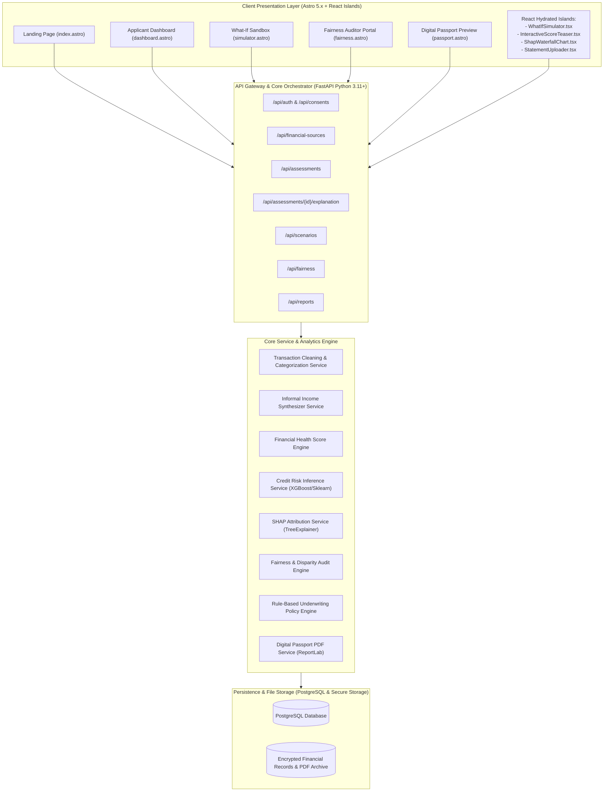
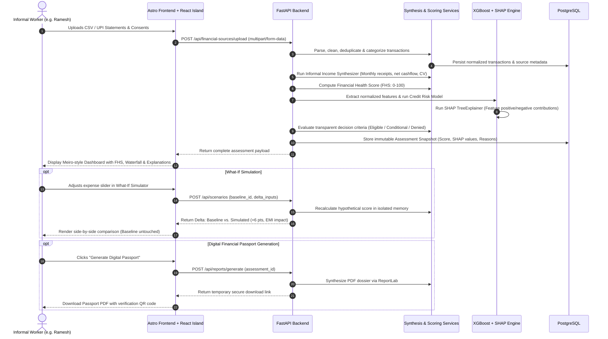
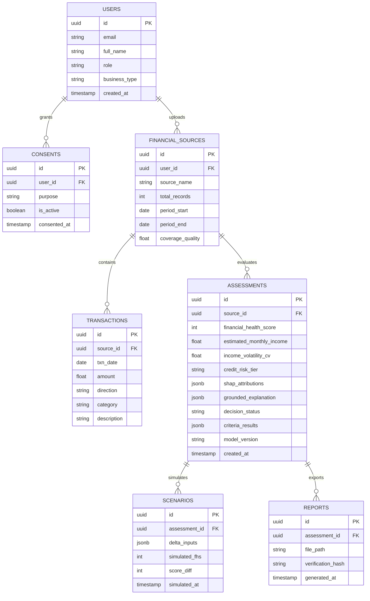

# System Architecture & Technical Specification

**System Name:** Explainable Alternative Credit Scoring & Informal Income Synthesizer  
**Architecture Style:** Modular Monolith (Astro SSR/SSG Frontend + FastAPI Async Backend)  
**Security & Governance:** Consent-First Architecture, Immutable Assessments, Fairlearn Auditing

---

## 1. High-Level System Topology



---

## 2. End-to-End Execution Flow



---

## 3. Frontend Architecture (Astro 5.x + React Islands)

### Why Astro 5.x?
1. **Zero Client-Side JavaScript by Default:** The Landing Page, Static Layouts, Navigation, Metric Displays, and Marketing Copy render as pure, lightning-fast HTML and CSS.
2. **Selective Island Hydration (`client:visible`, `client:load`):** Only interactive widgets load JavaScript:
   - `InteractiveScoreTeaser.tsx` loads when visible on the landing page.
   - `StatementUploader.tsx` loads when interacting with drag-and-drop.
   - `WhatIfSimulator.tsx` loads when the user manipulates sliders.
   - `ShapWaterfallChart.tsx` loads to render interactive Recharts tooltips.
3. **Institutional Aesthetic Control:** Seamless integration with our Obsidian Dark + Electric Lime token system (`memory.md`).

### Frontend Directory Structure
```text
frontend/
├── src/
│   ├── layouts/
│   │   ├── BaseLayout.astro        # HTML head, Google Fonts (Outfit, JetBrains Mono), meta
│   │   └── AppLayout.astro         # Authenticated shell (Meiro-style sidebar, topbar)
│   ├── components/
│   │   ├── astro/                  # Zero-JS presentation components
│   │   │   ├── Navbar.astro        # Landing page navigation with lime CTA
│   │   │   ├── Hero.astro          # High-impact hero with live preview teaser
│   │   │   ├── MetricCard.astro    # Meiro KPI card with (i) icon and bold white text
│   │   │   ├── FeatureGrid.astro   # 6 core feature cards with subtle borders
│   │   │   ├── VendorStory.astro   # Authentic micro-entrepreneur case study card
│   │   │   ├── TrustBadges.astro   # Consent-first and Fair Lending ethics badges
│   │   │   ├── Sidebar.astro       # Obsidian dark sidebar with active lime pill
│   │   │   └── Footer.astro        # Clean, institutional footer
│   │   └── react/                  # Hydrated interactive components
│   │       ├── ScoreTeaser.tsx     # Landing page interactive score simulator
│   │       ├── StatementUploader.tsx# Drag-and-drop CSV parser with sample pre-sets
│   │       ├── ShapChart.tsx       # Recharts waterfall of feature attributions
│   │       ├── WhatIfSandbox.tsx   # Dual-column before/after slider simulator
│   │       └── FairnessAuditor.tsx # Group parity charts and disparity alerts
│   ├── pages/
│   │   ├── index.astro             # High-converting landing page
│   │   ├── dashboard.astro         # Live assessment overview & income metrics
│   │   ├── upload.astro            # Statement ingestion & data preview
│   │   ├── explain.astro           # Grounded XAI & SHAP waterfall view
│   │   ├── fairness.astro          # Model audit portal & Fairlearn metrics
│   │   ├── simulator.astro         # What-If scenario sandbox
│   │   ├── decision.astro          # Transparent criteria checklist & reason codes
│   │   └── passport.astro          # Digital Financial Passport viewer & PDF download
│   ├── lib/
│   │   ├── api.ts                  # Typed Fetch client for FastAPI endpoints
│   │   ├── formatters.ts           # Currency (₹), percentages, and dates
│   │   └── mockData.ts             # Instant demo data for zero-latency preview
│   └── styles/
│       └── global.css              # Custom color tokens, font imports, scrollbar
├── astro.config.mjs
├── tailwind.config.cjs
├── package.json
└── tsconfig.json
```

---

## 4. Backend Architecture (FastAPI Modular Monolith)

### Service Boundaries & Responsibilities

| Service | Primary Responsibility | Core Libraries |
| :--- | :--- | :--- |
| `transaction_service.py` | Parses bank CSV/UPI records, validates schema, categorizes into receipts/expenses/transfers, detects anomalies. | `pandas`, `pydantic` |
| `income_service.py` | Estimates monthly gross turnover, net discretionary income, volatility CV, and data coverage indicators. | `numpy`, `scipy` |
| `financial_health_service.py`| Implements the deterministic 5-pillar composite scoring algorithm (0–100 scale). | Pure Python, `pydantic` |
| `credit_risk_service.py` | Evaluates default probability using a calibrated XGBoost / Logistic Regression model. | `xgboost`, `scikit-learn` |
| `shap_service.py` | Generates feature-level attribution values (TreeExplainer) and baseline references. | `shap` |
| `fairness_service.py` | Evaluates group disparity metrics (Demographic Parity, Equalized Opportunity) across cohorts. | `fairlearn`, `scikit-learn`|
| `scenario_service.py` | Evaluates What-If parameter variations without altering baseline database records. | Pure Python |
| `decision_service.py` | Compares features against institutional policy rules and outputs auditable reason codes. | Pure Python |

### Backend Directory Layout & ML Artifact Pipeline
```text
backend/
├── app/
│   ├── api/                     # FastAPI route handlers
│   │   ├── assessments.py
│   │   ├── financial_sources.py
│   │   ├── fairness.py
│   │   ├── scenarios.py
│   │   ├── decisions.py
│   │   └── reports.py
│   ├── core/
│   │   ├── config.py
│   │   └── security.py
│   ├── schemas/                 # Pydantic request & response schemas
│   │   ├── assessment.py
│   │   ├── transaction.py
│   │   └── scenario.py
│   └── services/                # Business logic & scoring engines
│       ├── transaction_service.py
│       ├── income_service.py
│       ├── financial_health_service.py
│       ├── credit_risk_service.py
│       ├── shap_service.py
│       ├── fairness_service.py
│       ├── scenario_service.py
│       ├── decision_service.py
│       └── passport_service.py
├── data/                        # Synthetic presets & training datasets
│   ├── generate_synthetic_data.py
│   ├── sample_street_vendor_ramesh.csv
│   ├── sample_gig_delivery_priya.csv
│   ├── sample_volatile_freelancer_arun.csv
│   └── training_cohort_5000.csv
├── ml/                          # ML training & XAI export pipelines
│   ├── train_risk_model.py
│   ├── export_shap_explainer.py
│   ├── audit_fairness.py
│   └── artifacts/               # Serialized model & XAI registry
│       ├── risk_model_xgboost.joblib
│       ├── shap_explainer.joblib
│       ├── baseline_value.json
│       ├── feature_names.json
│       ├── model_metrics.json
│       └── fairness_audit_report.json
├── tests/                       # Unit & invariant test suites
├── requirements.txt
└── main.py                      # FastAPI application entrypoint
```

---

## 5. Mathematical Formulations & Algorithms

### 5.1 Informal Income Synthesizer
Given a sequence of transactions $T = \{t_1, t_2, \dots, t_n\}$ spanning $M$ months:
1. **Filtering:** Exclude self-transfers, loan disbursements, and reversals:
   $$R_m = \sum \{ t_i \mid t_i \in \text{receipts}, \text{month}(t_i) = m \}$$
   $$E_m = \sum \{ |t_i| \mid t_i \in \text{business\_expenses}, \text{month}(t_i) = m \}$$
2. **Monthly Net Operating Surplus:**
   $$S_m = R_m - E_m$$
3. **Income Volatility (Coefficient of Variation):**
   $$CV = \frac{\sigma(R)}{\mu(R)}$$
   *Interpretation:* $CV < 0.20$ implies high stability; $CV > 0.50$ implies high seasonal volatility.
4. **Data Coverage Reliability Index:**
   $$\text{Coverage Score} = \min\left(100, \frac{M}{6} \times 100\right) \times (1 - \text{missing\_ratio})$$

### 5.2 Financial Health Score (FHS)
$$FHS = \sum_{k=1}^5 w_k \cdot \text{Normalized}(I_k)$$

| Pillar ($I_k$) | Weight ($w_k$) | Formula / Definition | Normalized Scale (0–100) |
| :--- | :--- | :--- | :--- |
| **Cashflow Surplus Ratio** | 30% | $\frac{\mu(S)}{\mu(R)}$ | $\text{Clamp}\left(\frac{\text{Ratio}}{0.40} \times 100, 0, 100\right)$ |
| **Income Consistency** | 25% | $1 - \min(1.0, CV)$ | $(1 - CV) \times 100$ |
| **Debt Burden Index** | 20% | $1 - \min\left(1.0, \frac{\text{Monthly EMI}}{\max(1, \mu(S))}\right)$ | $(1 - \text{Debt Ratio}) \times 100$ |
| **Reserve Buffer Days** | 15% | $\frac{\text{Min Balance}}{\text{Daily Average Expense}}$ | $\text{Clamp}\left(\frac{\text{Buffer Days}}{30} \times 100, 0, 100\right)$ |
| **Data Completeness** | 10% | Coverage Score from Synthesizer | Direct 0–100 score |

### 5.3 SHAP Feature Attribution
For the credit risk model output $f(x)$:
$$f(x) = \phi_0 + \sum_{j=1}^P \phi_j(x)$$
Where:
- $\phi_0$ is the expected model baseline across the training population.
- $\phi_j(x)$ is the SHAP attribution value for feature $j$ (positive pushes risk up; negative pushes risk down).

---

## 6. Complete API Specifications

| Method | Endpoint | Description | Request Body / Params | Response Summary |
| :--- | :--- | :--- | :--- | :--- |
| `POST` | `/api/auth/demo-login` | Generates JWT for demo applicant/auditor. | `{ "role": "applicant" \| "auditor" }` | `{ "access_token": "...", "user": {...} }` |
| `POST` | `/api/financial-sources/upload` | Ingests CSV statement. | `multipart/form-data (file, account_type)`| `{ "source_id": "...", "transaction_count": 142, "coverage_months": 4 }` |
| `POST` | `/api/assessments` | Calculates full FHS, Income, and ML Risk. | `{ "source_id": "..." }` | `{ "assessment_id": "...", "fhs": 84, "income_summary": {...}, "risk_tier": "Low" }` |
| `GET` | `/api/assessments/{id}` | Retrieves completed assessment. | Path parameter `id` | Full assessment payload with indicator breakdowns |
| `GET` | `/api/assessments/{id}/explanation` | Retrieves SHAP values and grounded narrative. | Path parameter `id` | `{ "baseline": 0.42, "shap_values": [...], "grounded_summary": "..." }` |
| `POST` | `/api/scenarios` | Evaluates hypothetical What-If delta. | `{ "assessment_id": "...", "delta_expenses": -4000, "delta_income": 5000 }` | `{ "simulated_fhs": 90, "delta": +6, "impact_factors": [...] }` |
| `GET` | `/api/decisions/{id}` | Returns policy criteria checklist & reason codes.| Path parameter `id` | `{ "status": "ELIGIBLE", "checklist": [...], "reason_codes": [...] }` |
| `GET` | `/api/fairness/audits` | Returns Fairlearn model disparity report. | Query `?model_version=v1.2` | `{ "demographic_parity_diff": 0.042, "equalized_odds_diff": 0.038, "cohorts": [...] }` |
| `POST` | `/api/reports` | Triggers PDF synthesis of Digital Passport. | `{ "assessment_id": "..." }` | `{ "report_id": "...", "download_url": "/api/reports/{id}/download" }` |
| `GET` | `/api/reports/{id}/download` | Streams signed PDF document. | Path parameter `id` | `application/pdf` binary stream |

---

## 7. Database Logical Schema


