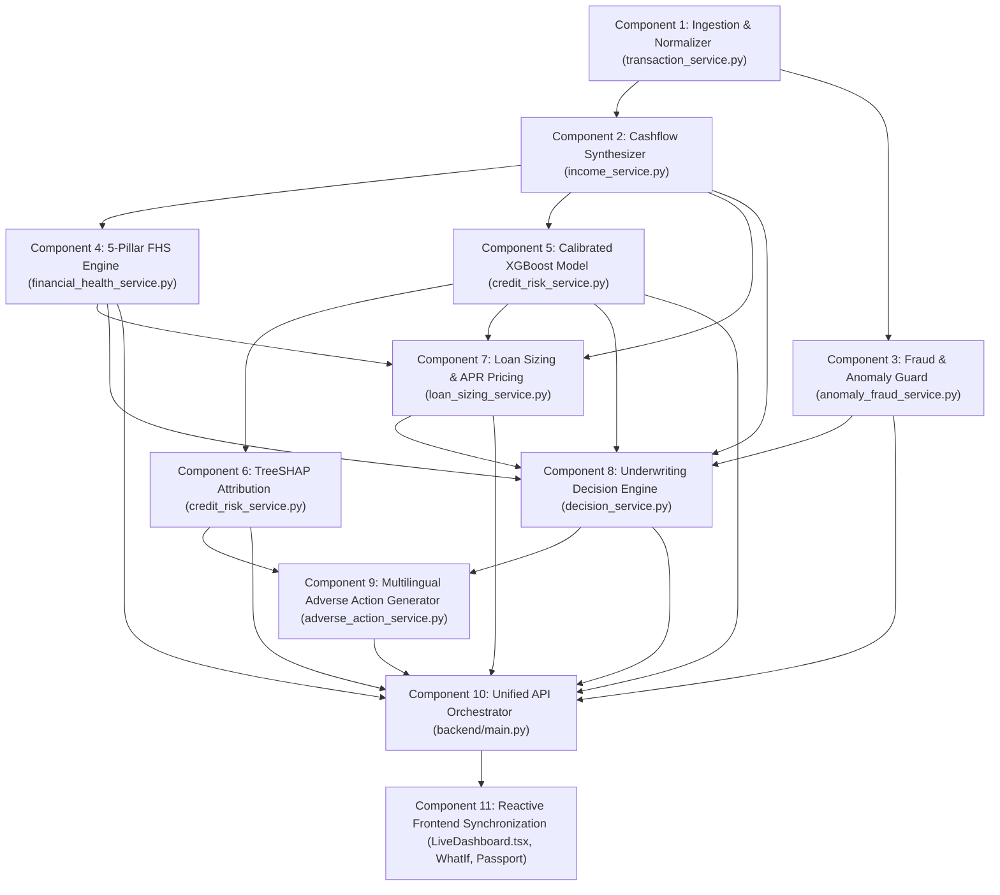

# Unified Credit Analytics Engine — Component Implementation & Verification Roadmap

**Project:** EquiScore (`hack`)  
**Strategy:** Component-by-Component Sequential Build, Verification, and Synchronization  
**Status Tracking:** `[ ]` Not Started | `[/]` In Progress | `[x]` Completed & Verified  

---

## Component Dependency & Execution Graph

---

## Component Checklist

### [x] Component 1: Transaction Ingestion & Normalization (`transaction_service.py`)
- [x] Task 1.1: Verify dynamic column alias mapping (dates, amounts, directions, categories, descriptions).
- [x] Task 1.2: Validate amount cleaning (stripping ₹, commas, handling negative values).
- [x] Task 1.3: Verify direction normalization (`CREDIT` vs `DEBIT`).
- [x] Task 1.4: Unit test on `sample_volatile_freelancer_arun.csv` (319 rows), `sample_street_vendor_ramesh.csv` (1,357 rows), and `sample_gig_delivery_priya.csv` (749 rows).

### [x] Component 2: Informal Cashflow Synthesizer (`income_service.py`)
- [x] Task 2.1: Verify monthly credit aggregation ($R_{\text{gross}}$), operational costs ($E_{\text{ops}}$), and EMI debits ($D_{\text{emi}}$).
- [x] Task 2.2: Verify net operating cashflow surplus ($S_{\text{net}}$) and operating margin calculations.
- [x] Task 2.3: Verify cashflow volatility coefficient ($CV = \frac{\sigma}{\mu}$) and 4-month reconstructed ledger table.
- [x] Task 2.4: Unit test and assert exact numerical outputs.

### [x] Component 3: Fraud & Transaction Anomaly Guard (`anomaly_fraud_service.py`)
- [x] Task 3.1: Build `anomaly_fraud_service.py` with Pydantic schemas (`AnomalyAuditReport`).
- [x] Task 3.2: Implement Customer Concentration Risk check ($>60\%$ volume from single counterparty).
- [x] Task 3.3: Implement Velocity Surge Anomaly check ($\ge 3.5\times$ daily surge in last 15 days).
- [x] Task 3.4: Implement Round-Trip Circular Transfer detection (matching debit/credit within 24 hours).
- [x] Task 3.5: Unit test with synthetic anomaly transactions and verify score penalty application.

### [x] Component 4: Deterministic 5-Pillar Financial Health Scoring (`financial_health_service.py`)
- [x] Task 4.1: Verify Cashflow Capacity Pillar (25%) formula and normalization.
- [x] Task 4.2: Verify Volatility Resilience Pillar (25%) formula.
- [x] Task 4.3: Verify Liquidity Buffer Days Pillar (20%) formula.
- [x] Task 4.4: Verify Behavioral Consistency (15%) and Debt Burden (15%) pillars.
- [x] Task 4.5: Wire Component 3 fraud risk penalty into the overall FHS calculation.
- [x] Task 4.6: Unit test with edge cases (zero balance, negative surplus, extreme volatility).

### [x] Component 5: Calibrated XGBoost Credit Risk Model (`credit_risk_service.py`)
- [x] Task 5.1: Validate 8-dimensional feature vector extraction matching training schema.
- [x] Task 5.2: Verify model loading from `calibrated_pipeline.joblib`.
- [x] Task 5.3: Verify Platt calibrated probability inference (`predict_proba`) and risk tier classification (`TIER_1_LOW_RISK`, `TIER_2_MODERATE_RISK`, `TIER_3_ELEVATED_RISK`).
- [x] Task 5.4: Unit test with live borrower feature vectors.

### [x] Component 6: TreeSHAP Game-Theoretic Attribution Engine (`credit_risk_service.py`)
- [x] Task 6.1: Verify `shap_explainer.joblib` loading and baseline value $\phi_0$.
- [x] Task 6.2: Compute local Shapley values $\phi_i$ for each feature.
- [x] Task 6.3: Verify additivity guarantee: $\phi_0 + \sum \phi_i = \text{Model Margin}$.
- [x] Task 6.4: Format human-readable impact direction (`REDUCES_RISK` vs `INCREASES_RISK`) and narrative.
- [x] Task 6.5: Unit test SHAP output structure.

### [x] Component 7: Loan Sizing, Safe EMI & APR Pricing Engine (`loan_sizing_service.py`)
- [x] Task 7.1: Build `loan_sizing_service.py` with `LoanOfferRecommendation` schema.
- [x] Task 7.2: Calculate safe monthly EMI capacity ($\le 35\%$ of net surplus discounted for volatility).
- [x] Task 7.3: Implement risk-adjusted APR and tenure tiering (Tier 1: 14.5% / 12 mo; Tier 2: 18% / 6 mo; Tier 3: 24% / 3 mo).
- [x] Task 7.4: Implement present value loan principal calculation and $3\times$ gross receipts cap.
- [x] Task 7.5: Unit test with Arun, Ramesh, and Priya profiles.

### [x] Component 8: Underwriting Policy & Decision Engine (`decision_service.py`)
- [x] Task 8.1: Update `decision_service.py` to evaluate the 6 core institutional rules.
- [x] Task 8.2: Incorporate fraud flags from Component 3 and loan sizing from Component 7.
- [x] Task 8.3: Produce actionable next steps and reason codes.
- [x] Task 8.4: Unit test policy criteria under passing, failing, and fraud-override conditions.

### [x] Component 9: Multilingual Adverse Action Notice Generator (`adverse_action_service.py`)
- [x] Task 9.1: Build `adverse_action_service.py` supporting English, Hindi, and Marathi.
- [x] Task 9.2: Implement deterministic regulatory fallback templates with top negative SHAP factors.
- [x] Task 9.3: Add Gemini enhancement with fallback safety.
- [x] Task 9.4: Unit test letter generation across all 3 languages (EN, HI, MR).

### [x] Component 10: Unified API Orchestration Gateway (`backend/main.py`)
- [x] Task 10.1: Update `AssessmentUnifiedResponse` schema with loan offer, fraud report, and adverse action options.
- [x] Task 10.2: Wire Components 1 through 9 inside `_orchestrate_assessment()`.
- [x] Task 10.3: Add `POST /api/assessments/batch` endpoint (bulk processing up to 50 statements).
- [x] Task 10.4: Add `POST /api/decisions/{id}/letter` and `GET /api/decisions/{id}/letter` endpoint for multilingual letters.
- [x] Task 10.5: Run integration tests on `/api/assessments/upload`, `/api/assessments/preset` with Arun, Ramesh, Priya, and batch processing.

### [ ] Component 11: Reactive Frontend Synchronization
- [ ] Task 11.1: Update `LiveDashboard.tsx` to display Loan Offer Sizing Card (Max Principal, Safe EMI, APR, Tenure).
- [ ] Task 11.2: Add Fraud & Transaction Integrity Audit status badge and concentration meter to `LiveDashboard.tsx`.
- [ ] Task 11.3: Add Adverse Action Letter modal/drawer with English/Hindi/Marathi toggles.
- [ ] Task 11.4: Verify seamless data synchronization across `/dashboard`, `/simulator`, `/passport`, and `/fairness`.
- [ ] Task 11.5: Verify complete end-to-end flow with browser subagent.
